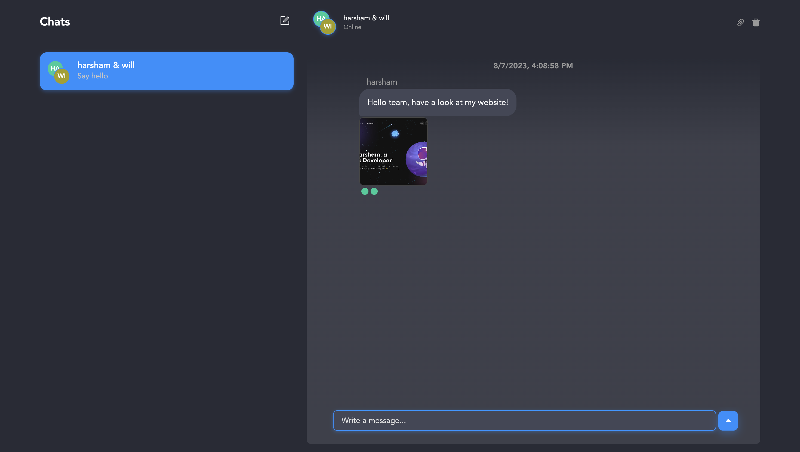

# Full Stack Chat App Experimentation

## Description

This is a functioning Full Stack React Chat application, made predominantly to understand the integration of a frontend and backend application using services such as Vite, React, Node.js and chatengine.io to store data regarding users, messages and online status'.

## Demo





## Getting Started

### Prerequisites

- [Node.js](https://nodejs.org/en/) (>= 19.9.0)
- [NPM](https://docs.npmjs.com/cli/v9/commands/npm-install) (>= 9.6.3)

### Installing backend

```bash
cd backend/
npm install
```

Installs the necessary dependencies to run the application locally.

### Running backend

```bash
npm run start
```

### Installing frontend

```bash
cd frontend/
npm install
```

Installs the necessary dependencies to run the application locally.

### Running frontend

```bash
npm run dev
```

Runs the app in the development mode.\
Open [http://localhost:5173](http://localhost:5173) to view it in your browser.

The page will reload when you make changes.\
You may also see any lint errors in the console.


## Built With

- [Vite](https://vitejs.dev/) - Build tool for modern web apps.
- [React](https://reactjs.org/) - A JavaScript library for building user interfaces.
- [Node.js](https://nodejs.org/) - JavaScript runtime for server-side applications.
- [ChatEngine](https://www.chatengine.io/) - Chat development framework.
- [react-chat-engine-pretty](https://chatengine.io/docs/react/v1/customize_ui/components) - Developer-friendly Chat UI Kit.


## Future Improvements & Challenges Faced

- Incorporate a sign up page.
- Host online for mass usage to simulate and create my very own messaging service.


## Key Takeaways & Successes

- Understood how a full stack application is somewhat built.
- Comfortable with integrating frontend and backend.
- Able to install and use libraries that were responsible for the heavy lifting and made it more efficient for me as the developer to progress.

